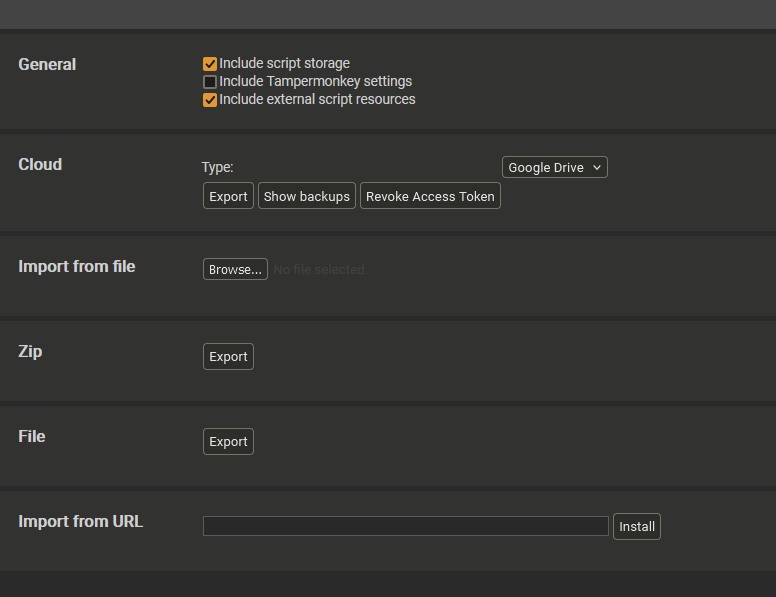
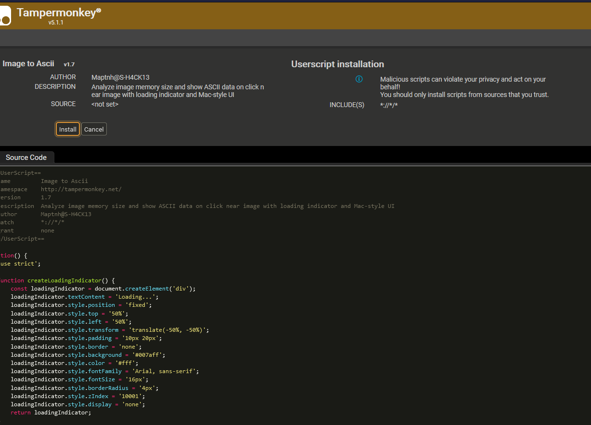
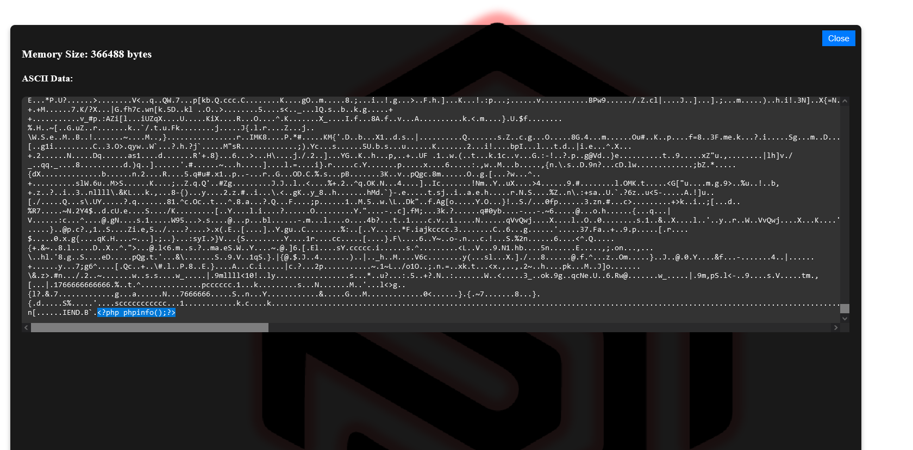
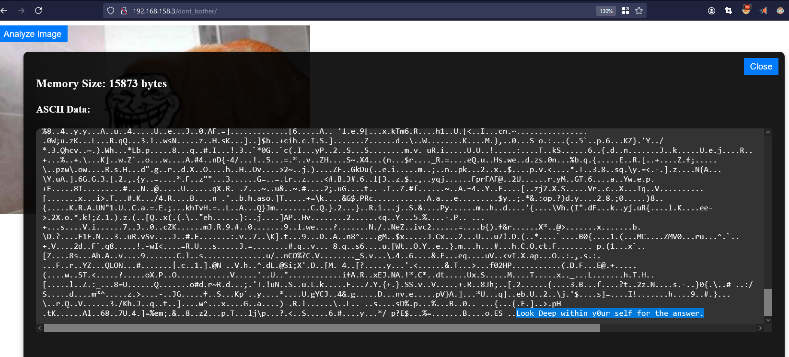

# Import

Import `ImagetoAscii.user.js` into Tampermonkey.

Follow these steps:

# Analyzing Images on Websites

When hovering near the image, an analysis button will appear.

By inspecting the image information, we can quickly discover that this image contains PHP code. During penetration testing, you can quickly check whether PHP code in uploaded image trojans is filtered or if there are hidden sensitive information within the image.

